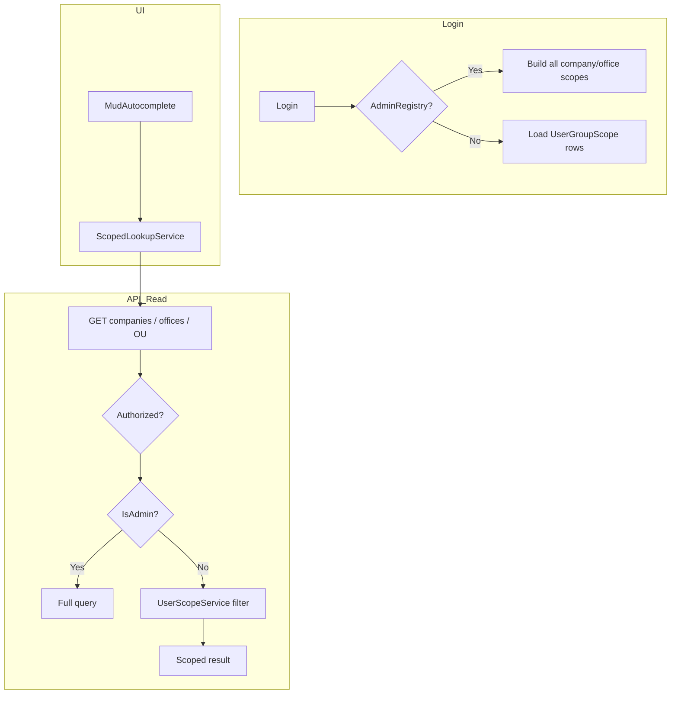

# Skema Modifikasi — Admin vs UserGroupScope (Company / Office / Organization)

> **Tanggal:** 2026-07-09  
> **Konteks:** Admin (dari `admin.registry.enc`) harus melihat **semua** Company, CompanyOffice, OrganizationUnit. Non-admin hanya data yang **berinterseksi** dengan `[core].[UserGroupScope]`.  
> **Status saat ini:** Login & menu sudah scoped; **API read + combobox belum**.

---

## 1. Tujuan

| Actor | Company | CompanyOffice | OrganizationUnit |
|-------|---------|---------------|------------------|
| **Admin** | Semua | Semua | Semua |
| **Non-admin** | Hanya company di `UserGroupScope` | Hanya office yang diizinkan per company¹ | Hanya OU yang punya `OrganizationUnitScope` ∩ scope user |

¹ Jika `UserGroupScope.CompanyOfficeId IS NULL` → semua office di company tersebut. Jika terisi → office itu saja.

Berlaku untuk:
- Halaman list (CompanyList, OrganizationUnitList, …)
- Form header
- **Semua combobox/autocomplete** Company, CompanyOffice, Organization

---

## 2. Prinsip arsitektur

```
┌─────────────────────────────────────────────────────────────┐
│  Sumber kebenaran scope: UserGroupScope (+ admin bypass)    │
│  Enforcement: API (wajib) — UI hanya konsumen               │
└─────────────────────────────────────────────────────────────┘
```

1. **Filter di API**, bukan hanya di Blazor — mencegah bypass via HTTP langsung.
2. **Satu layanan scope terpusat** di API — hindari duplikasi SQL di setiap repository.
3. **Admin = early return tanpa filter** — pola sama dengan `GetAllowedProgramsAsync` (admin → all programs).
4. **JWT wajib** untuk endpoint master data (`[Authorize]`).
5. **Active context** (`JWT CompanyId/OfficeId`) ≠ **accessible scope** (semua baris UserGroupScope user). Combobox master data pakai **accessible scope**, bukan hanya company aktif.

---

## 3. Model data (existing)

### UserGroupScope — hak akses user

```
[core].[UserGroupScope]
  UserId, UserGroupId
  CompanyId, CompanyGuid
  CompanyOfficeId?, CompanyOfficeGuid?   -- NULL = all offices in company
  IsDefault
```

### OrganizationUnitScope — OU berlaku di company/office mana

```
[app].[OrganizationUnitScope]
  OrganizationUnitId
  CompanyId, CompanyOfficeId?
  ScopeType  ('COMPANY' | 'OFFICE')
```

### Admin

- Ditentukan `AdminRegistryService` → JWT `Role = Admin` → `IUserContext.IsAdmin`

---

## 4. Aturan bisnis (formal)

### 4.1 Accessible companies (non-admin)

```sql
SELECT DISTINCT ugs.CompanyId, c.CompanyGuid, c.CompanyName
FROM core.UserGroupScope ugs
JOIN app.Company c ON c.CompanyId = ugs.CompanyId
WHERE ugs.UserId = @UserId AND ugs.StatusId > 0 AND ugs.DeletedTime IS NULL
```

### 4.2 Accessible offices untuk company C (non-admin)

User boleh lihat office O di company C jika **ada** baris UserGroupScope:

```
(CompanyId = C AND CompanyOfficeId IS NULL)           -- all offices
OR (CompanyId = C AND CompanyOfficeId = O)          -- specific office
```

### 4.3 Accessible OrganizationUnit (non-admin)

OU visible jika **exists** OrganizationUnitScope `ous` sehingga:

```
EXISTS scope user ugs WHERE
  ugs.UserId = @UserId
  AND (
    -- OU scoped to whole company
    (ous.ScopeType = 'COMPANY' AND ous.CompanyId = ugs.CompanyId
     AND ugs.CompanyOfficeId IS NULL)
    OR
    (ous.ScopeType = 'COMPANY' AND ous.CompanyId = ugs.CompanyId
     AND ugs.CompanyOfficeId IS NOT NULL)  -- user scoped to one office still sees company-level OU
    OR
    -- OU scoped to specific office
    (ous.ScopeType = 'OFFICE' AND ous.CompanyId = ugs.CompanyId
     AND (ugs.CompanyOfficeId IS NULL OR ous.CompanyOfficeId = ugs.CompanyOfficeId))
  )
```

> **Catatan:** Aturan OU level COMPANY vs OFFICE perlu dikonfirmasi dengan bisnis. Skema di atas: user dengan akses office tunggal tetap melihat OU ber-scope COMPANY di company yang sama.

### 4.4 Admin

Semua query di atas **dilewati** — return full dataset (dengan `StatusId > 0` seperti sekarang).

---

## 5. Perubahan API — layer baru

### 5.1 Perluas `IUserContext`

**File:** `Contracts/IUserContext.cs`, `BamboeUp.Api/Context/UserContext.cs`

```csharp
long? UserGroupScopeId { get; }   // dari JWT (sudah ada di token, belum di context)
bool IsAdmin { get; }            // existing
```

### 5.2 Service baru: `IUserScopeService`

**Lokasi:** `Service.Shell/UserScopeService.cs`  
**Kontrak:** `Service.Contracts.Shell/IUserScopeService.cs`

| Method | Return | Kegunaan |
|--------|--------|----------|
| `GetAccessibleCompaniesAsync()` | `IEnumerable<CompanyDto>` | List + combobox company |
| `GetAccessibleOfficesAsync(long companyId)` | `IEnumerable<CompanyOfficeDto>` | Combobox office per company |
| `GetAccessibleOfficesByCompanyGuidAsync(Guid companyGuid)` | same | Wrapper GUID |
| `CanAccessCompanyAsync(long companyId)` | `bool` | Guard GET by id |
| `CanAccessOfficeAsync(long companyId, long? officeId)` | `bool` | Guard |
| `GetAccessibleOrganizationUnitsAsync()` | `IEnumerable<OrganizationUnitDto>` | List OU |
| `FilterAccessibleOrganizationUnitIds()` | subquery / temp table | Dipakai search OU |

**Implementasi:** inject `IUserContext` + `IRepositoryManager`. Admin → delegate ke repo existing (all). Non-admin → SQL di §4.

**Cache:** optional `IMemoryCache` keyed by `UserId` (TTL 5 menit) — scope jarang berubah saat session.

### 5.3 Repository tambahan (minimal)

**File:** `Repository/UserScopeRepository.cs` + `IUserScopeRepository`

Hanya query scope — **tidak** CRUD. Dipanggil oleh `UserScopeService`.

Alternatif: extend `UserGroupScopeRepository` dengan method `GetAccessibleCompaniesAsync(userId)`.

---

## 6. Perubahan API — per entitas

### 6.1 Company

| Endpoint | Modifikasi |
|----------|------------|
| `GET /api/companies` | Non-admin → `UserScopeService.GetAccessibleCompaniesAsync()` |
| `GET /api/companies/search` | Same filter (search dalam subset accessible) |
| `GET /api/companies/{guid}` | Guard `CanAccessCompanyAsync` → 403 jika tidak |
| `POST/PUT/DELETE` | Tetap `[AuthorizeProgram]` di UI; API tambah guard scope write (opsional fase 2) |

**Files:** `CompanyRepository` (optional raw SQL), `CompanyService`, `CompaniesController`  
**Tambah:** `[Authorize]` class-level di `CompaniesController`

### 6.2 CompanyOffice

| Endpoint | Modifikasi |
|----------|------------|
| `GET /api/companyOffices` | Ganti filter JWT-only → `GetAccessibleOfficesAsync` (all companies user punya) |
| `GET /api/companies/{guid}/offices` | **Wajib** filter accessible offices untuk company tersebut |
| Search | Filter accessible + search params |
| `GET by guid` | Guard `CanAccessOfficeAsync` |

**Files:** `CompanyOfficeRepository`, `CompanyOfficeService`, `CompanyOfficesController`  
Hapus duplikasi logic `_userContext.IsAdmin` di repo — pindah ke `UserScopeService`.

### 6.3 OrganizationUnit

| Endpoint | Modifikasi |
|----------|------------|
| `GET /api/organizationUnits` | Non-admin → join/filter via §4.3 |
| Search | Tambah predicate `OrganizationUnitId IN (accessible)` |
| `GET by guid` | Guard accessible |
| Nested scope endpoints | Tetap; parent OU harus accessible |

**Files:** `OrganizationUnitRepository`, `OrganizationUnitService`, `OrganizationUnitsController`

### 6.4 Endpoint dedicated (opsional, disarankan)

```
GET /api/user-scope/companies
GET /api/user-scope/companies/{companyGuid}/offices
GET /api/user-scope/organization-units
```

Keuntungan: combobox UI tidak perlu memanggil endpoint “full list” yang difilter implisit — intent jelas, payload kecil.

---

## 7. Perubahan UI (Blazor App)

### 7.1 Pola combobox baru (standar)

**Buat:** `ScopedLookupService` (AppShell)

```csharp
Task<IReadOnlyList<CompanyDto>> GetAccessibleCompaniesAsync();
Task<IReadOnlyList<CompanyOfficeDto>> GetAccessibleOfficesAsync(Guid companyGuid);
Task<IReadOnlyList<OrganizationUnitDto>> GetAccessibleOrganizationUnitsAsync();
```

Memanggil endpoint scoped (§6.4) atau filtered list existing.

### 7.2 File UI yang wajib diubah

| File | Perubahan |
|------|-----------|
| `CostCenterScopeSection.razor` | `CompanyService.GetListAsync()` → `ScopedLookupService` |
| `OrganizationUnitScopeSection.razor` | idem |
| `UserGroupScopeSection.razor` | idem (admin lihat all via API) |
| `ParameterscopeSection.razor` | idem |
| `StandardReferenceScopeSection.razor` | idem |
| `CompanyList.razor` | list scoped |
| `OrganizationUnitList.razor` | list scoped |
| `CompanyForm.razor` | parent company picker scoped |
| Combobox OU di form lain | audit & ganti ke scoped lookup |

### 7.3 Client-side fallback (defense in depth)

Jika API belum deploy: filter `GlobalContext.AvailableScopes` → distinct companies — **sementara**, bukan pengganti API.

```csharp
// HANYA fallback — authoritative tetap API
var allowedCompanyIds = Global.AvailableScopes.Select(s => s.CompanyId).Distinct();
_companies = allCompanies.Where(c => allowedCompanyIds.Contains(c.CompanyId));
```

### 7.4 Login scope combo

**File:** `Login.razor`  
Hapus DEBUG mock scopes. Alur:

1. User submit username/password (tanpa scope) → API return `AvailableScopes` (sudah ada di `TokenDto`)
2. Jika >1 scope → tampilkan combo dari `AvailableScopes` response pre-login **atau** step 2 login

---

## 8. Diagram alur



---

## 9. Fase implementasi

```
S1  API scope — Company, CompanyOffice
S2  API scope — OrganizationUnit
S3  App manual — ScopedLookupService + ScopeSection + List pages
S3b SchemaStudio UI generator — UiFieldBlockGenerator + TemplateUi*.md  ← WAJIB sebelum generate modul baru
S4  Hardening + template docs API/UI + /api/user-scope/*
S5  Optional — write guard + cache
```

### Fase S1 — Foundation (1–2 hari)

- [ ] `[Authorize]` pada Controllers: Companies, CompanyOffices, OrganizationUnits
- [ ] `IUserScopeService` + repository queries §4.1–4.2
- [ ] `GET /api/companies` + `GET /api/companies/{guid}/offices` scoped
- [ ] Unit test: admin=all, user2=subset UserGroupScope

### Fase S2 — OrganizationUnit (1 hari)

- [ ] Query §4.3 + list/search OU scoped
- [ ] Guard GET by guid

### Fase S3 — App manual (1–2 hari)

- [ ] `ScopedLookupService` + `IScopedLookupService` (AppShell, register DI)
- [ ] Ganti 5× `*ScopeSection.razor` (CostCenter, OU, UserGroup, Parameter, StandardReference)
- [ ] `CompanyList.razor`, `OrganizationUnitList.razor`
- [ ] Verifikasi manual dengan user admin vs non-admin (test plan §11 #7)

### Fase S3b — SchemaStudio UI generator (0.5–1 hari) **WAJIB sebelum generate modul UI baru**

> **Mengapa tidak S5?** Modul Header-Detail yang di-generate setelah S3 tapi sebelum S3b masih emit `CompanyService.GetListAsync()` (unscoped).

- [ ] `UiFieldBlockGenerator.cs` — CompanyScope block:
  - `CompanyService.GetListAsync()` → `ScopedLookupService.GetAccessibleCompaniesAsync()`
  - `CompanyService.GetOfficesAsync()` → `ScopedLookupService.GetAccessibleOfficesAsync()`
  - Inject `@inject IScopedLookupService ScopedLookupService`
- [ ] `TemplateUiHeaderDetail.md` — dokumentasi + contoh inject `IScopedLookupService`
- [ ] `TemplateUiNewAddDetail.md` — referensi CompanyScope pattern scoped
- [ ] Test generator: dry-run CostCenterScopeSection → tidak ada `GetListAsync()` untuk company combobox
- [ ] `ScopedLookupService` tetap **artefak manual sekali** di App (bukan di-generate per modul)

### Fase S4 — Hardening + template docs (1 hari)

- [ ] Dedicated `/api/user-scope/*` endpoints
- [ ] `Login.razor` — hapus mock scopes, pakai `AvailableScopes` dari API
- [ ] 403 konsisten + audit log attempt
- [ ] Hapus filter JWT-only lama di `CompanyOfficeRepository` (ganti `UserScopeService`)
- [ ] **Template API (ringan):** catatan di `TemplateApiHeaderDetail.md` — `[Authorize]`, jangan bypass scope di custom endpoint
- [ ] **Template UI docs:** `TemplateUi1Table.md`, `Code Generator Template.md` — aturan combobox scoped

### Fase S5 — Optional (runtime hardening)

- [ ] Write guard (create/update scope di company/office di luar hak user → 403)
- [ ] Cache `UserScopeService` (`IMemoryCache`, TTL 5 menit per UserId)
- [ ] Feature flag `UseScopedMasterData` (rollback tanpa deploy)

**Tidak termasuk S5:** perubahan template generator — sudah di **S3b**.

---

## 10. Dampak generator / template (per fase)

### S3b — perubahan codegen (wajib)

| File | Perubahan |
|------|-----------|
| `SchemaStudio.Generator/Renderer/UiFieldBlockGenerator.cs` | CompanyScope: scoped lookup |
| `Templates/UI/TemplateUiHeaderDetail.md` | Inject + aturan combobox |
| `Templates/UI/TemplateUiNewAddDetail.md` | Referensi scope section |

### S4 — dokumentasi template (tanpa refactor besar API template)

| File | Perubahan |
|------|-----------|
| `Templates/Api/TemplateApiHeaderDetail.md` | Catatan: master data scoped via `UserScopeService`; `[Authorize]` controller |
| `Templates/UI/TemplateUi1Table.md` | List page → scoped API atau `ScopedLookupService` |
| `Templates/Code Generator Template.md` | Pola `ICompanyService` vs `IScopedLookupService` |

**Aturan (semua template UI):**

```
Combobox Company / Office / Organization
  → WAJIB ScopedLookupService / api/user-scope/*
  → JANGAN CompanyService.GetListAsync() untuk master data scoped
```

**Template API HeaderDetail:** tidak generate Company list — dampak minimal, hanya catatan arsitektur.

---

## 11. Test plan

| # | Scenario | Expected |
|---|----------|----------|
| 1 | Admin login → GET companies | Semua company |
| 2 | User A scope: Co1(all office), Co2(Office X) → GET companies | Co1, Co2 only |
| 3 | User A → GET offices Co1 | All offices Co1 |
| 4 | User A → GET offices Co2 | Office X only |
| 5 | User A → GET organizationUnits | OU whose OrganizationUnitScope ∩ scope A |
| 6 | User A → GET company Co3 by guid | 403 |
| 7 | Combobox CostCenterScopeSection as User A | Same as #2–4 |
| 8 | Switch scope → menu changes, combobox unchanged (still all accessible, not only active) | Accessible = UserGroupScope union |

---

## 12. Risiko & mitigasi

| Risiko | Mitigasi |
|--------|----------|
| Breaking existing screen yang assume full list | Fase rollout; feature flag `UseScopedMasterData` |
| Performa join OU scope | Index `(UserId, CompanyId)` on UserGroupScope; cache |
| OU COMPANY vs OFFICE rule ambiguous | Konfirmasi bisnis sebelum Fase S2 |
| Endpoint tanpa `[Authorize]` | Global authorization filter di `Program.cs` |

---

## 13. Ringkasan file baru / ubah

| Aksi | Path |
|------|------|
| **NEW** | `Contracts/IUserScopeRepository.cs` |
| **NEW** | `Repository/UserScopeRepository.cs` |
| **NEW** | `Service.Contracts.Shell/IUserScopeService.cs` |
| **NEW** | `Service.Shell/UserScopeService.cs` |
| **NEW** | `Presentation.Shell/Controllers/UserScopeController.cs` (opsional) |
| **NEW** | `AppShell/Services/ScopedLookupService.cs` |
| **EDIT** | `IUserContext`, `UserContext` (+ UserGroupScopeId) |
| **EDIT** | `CompanyService`, `CompanyOfficeService`, `OrganizationUnitService` |
| **EDIT** | `*ScopeSection.razor` (5 files), `CompanyList`, `OrganizationUnitList` |
| **EDIT** | `Login.razor` (remove mock scopes) |
| **EDIT** | `Program.cs` (DI register + optional global authorize) |
| **EDIT S3b** | `SchemaStudio.Generator/Renderer/UiFieldBlockGenerator.cs` |
| **EDIT S3b** | `Templates/UI/TemplateUiHeaderDetail.md`, `TemplateUiNewAddDetail.md` |
| **EDIT S4** | `Templates/Api/TemplateApiHeaderDetail.md`, `TemplateUi1Table.md` (docs only) |

---

*Dokumen ini melengkapi admin registry (`admin.registry.enc`) — admin bypass scope hanya berlaku jika user terdaftar di registry, bukan kolom DB.*
