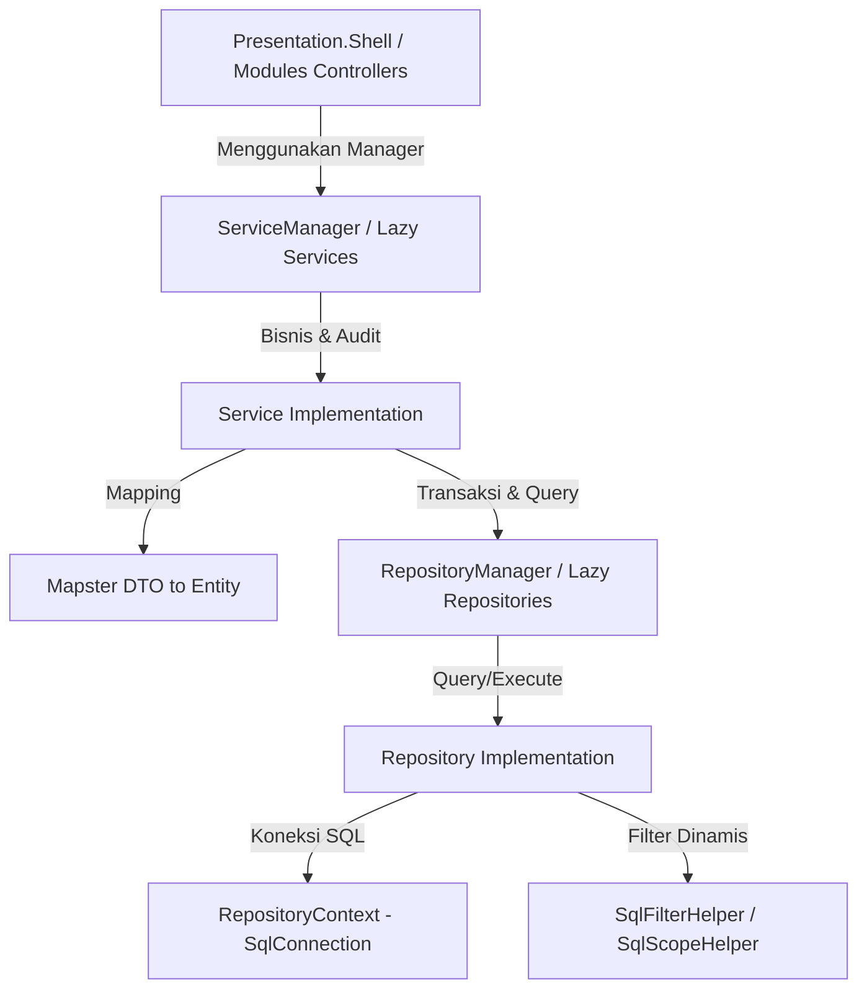

# Panduan & Template Pembuatan API (BamboeUp)

Dokumen ini merupakan panduan arsitektur dan cetak biru (blueprint) lengkap untuk pembuatan API baru di proyek **BamboeUp.Api**. Dokumentasi ini didasarkan pada analisis kode riil dari entitas **Bank** (Kasus 1 Tabel) serta **Company & CompanyOffice** (Kasus Header-Detail).

---

## 🏗️ Struktur Arsitektur & Alur Data
Proyek ini menggunakan arsitektur berlapis (Clean Architecture/Onion style) dengan data access menggunakan **Dapper** (Raw SQL) dan pemetaan objek menggunakan **Mapster**. Dependency Injection dikelola secara terpusat melalui class **Manager** (`RepositoryManager`, `ServiceShellManager`, `ServiceModulesManager`) yang diinstansiasi secara *lazy-loaded* (`Lazy<T>`) untuk menghindari pembengkakan constructor.

Untuk mendukung generator kode otomatis (*code generator*) tanpa menimpa kode kustom, **seluruh kelas repository, service, dan controller serta interface mereka dideklarasikan sebagai `partial`**.



---

## 🧩 Pola Kustomisasi Partial (Partial Extension Pattern)
Semua class generator dideklarasikan dengan kata kunci `partial`. Untuk menambahkan kode kustom (seperti query tambahan, method bisnis baru, atau endpoint API baru), developer tidak boleh mengubah file generator. Sebaliknya, gunakan subfolder `Custom/` di masing-masing layer dengan namespace yang sama.

### Aturan Utama Partial:
1. **Namespace Sama**: File di dalam subfolder kustom wajib menggunakan namespace yang sama dengan file utama (abaikan folder `.Custom` dalam deklarasi namespace).
2. **Kombinasi Saat Build**: C# Compiler akan otomatis menyatukan file kustom dan file generator saat aplikasi di-build. Tidak ada runtime overhead (0% dampak performa).
3. **Pemisahan File Kustom**: File generator bebas ditimpa/dihapus ulang oleh code generator tanpa merusak atau menghilangkan logika kustom yang diletakkan di subfolder `Custom/`.

---

## 📁 Folder Structure Reference
Berikut letak folder file utama (Generated) dan file kustom (Custom):

```
📂 BamboeUp.Api
 ├── 📂 Entities (Model Database)
 │    └── 📂 Models (e.g. Bank.cs, Company.cs, CompanyOffice.cs)
 ├── 📂 Shared (DTO & Enums)
 │    └── 📂 DataTransferObjects (e.g. BankDto.cs, CompanyDto.cs)
 ├── 📂 Contracts (Interface Repository)
 │    ├── 📂 Custom (e.g. IBankRepository.cs - untuk custom interface)
 │    └── IBankRepository.cs (Generated)
 ├── 📂 Repository (Implementasi Dapper & ADO.NET)
 │    ├── 📂 Extensions (SqlFilterHelper.cs, SqlScopeHelper.cs)
 │    ├── 📂 Custom (e.g. BankRepository.cs - untuk custom queries)
 │    └── BankRepository.cs (Generated)
 ├── 📂 Service.Contracts.Shell / Modules (Interface Service)
 │    ├── 📂 Custom (e.g. IBankService.cs - untuk custom signature)
 │    └── IBankService.cs (Generated)
 ├── 📂 Service.Shell / Modules (Implementasi Bisnis, Transaksi & Audit)
 │    ├── 📂 Custom (e.g. BankService.cs - untuk custom logic)
 │    └── BankService.cs (Generated)
 └── 📂 Presentation.Shell / Modules (Controllers)
      ├── 📂 Custom (e.g. BanksController.cs - untuk custom endpoints)
      └── BanksController.cs (Generated)
```

---

## 🗃️ KASUS 1: Single Table CRUD (Contoh: Bank)

Modul tabel tunggal digunakan untuk master data sederhana yang tidak memiliki relasi komposisi (parent-child) yang harus dikelola bersamaan dalam satu transaksi layar.

### 1. Entity Model (`Entities/Models/Bank.cs`)
Mendefinisikan skema database dasar, status, konkurensi (`RowVersion`), dan audit trail (`Created`, `Updated`, `Deleted`).

```csharp
using System;
using System.ComponentModel.DataAnnotations;
using System.ComponentModel.DataAnnotations.Schema;

namespace Entities.Models
{
    [Table("Bank", Schema = "core")]
    public class Bank
    {
        [Column("BankId")]
        [DatabaseGenerated(DatabaseGeneratedOption.Identity)]
        public long BankId { get; set; }

        [Key]
        [Column("BankGuid")]
        [DatabaseGenerated(DatabaseGeneratedOption.Identity)]
        public Guid BankGuid { get; set; } = Guid.NewGuid();

        [Required]
        [MaxLength(200)]
        public string BankName { get; set; }

        [Required]
        [MaxLength(15)]
        public string BankInitial { get; set; }

        [Column("StatusId")]
        public long StatusId { get; set; } = 0; // 0 = Deleted, 1 = Created, 2 = Updated

        [Timestamp]
        public byte[]? RowVersion { get; set; }

        [Column("CreatedById")]
        public long CreatedById { get; set; } = 0;

        [Required]
        public DateTime CreatedTime { get; set; }

        [Column("UpdatedById")]
        public long UpdatedById { get; set; } = 0;

        public DateTime? UpdatedTime { get; set; }

        [Column("DeletedById")]
        public long DeletedById { get; set; } = 0;

        public DateTime? DeletedTime { get; set; }
    }
}
```

### 2. Data Transfer Objects (`Shared/DataTransferObjects/BankDto.cs`)
DTO dipisah berdasarkan fungsinya: Query, Creation, Update, Delete, dan Search.

```csharp
using Shared.Settings.Enums;

namespace Shared.DataTransferObjects
{
    public record BankDto
    {
        public long BankId { get; set; }
        public Guid BankGuid { get; init; }
        public string BankName { get; set; }
        public string BankInitial { get; set; }
        public int StatusId { get; set; }
        public byte[] RowVersion { get; set; }
        public long CreatedById { get; set; }
        public DateTime CreatedTime { get; set; }
        public long? UpdatedById { get; set; }
        public DateTime? UpdatedTime { get; set; }
        public long? DeletedById { get; set; }
        public DateTime? DeletedTime { get; set; }
    }

    public record BankForCreationDto
    {
        public string BankName { get; set; }
        public string BankInitial { get; set; }
        public long CreatedById { get; set; } = 0;
    }

    public record BankForUpdateDto
    {
        public string BankName { get; set; }
        public string BankInitial { get; set; }
        public long UpdatedById { get; set; }
    }

    public record BankForDeleteDto
    {
        public long DeletedById { get; set; }
    }

    public class BankSearchDto
    {
        public string? BankName { get; set; }
        public SearchType BankNameSearchType { get; set; } = SearchType.Contains;

        public string? BankInitial { get; set; }
        public SearchType BankInitialSearchType { get; set; } = SearchType.Contains;
    }
}
```

### 3. Repository Contract (`Contracts/IBankRepository.cs`)
```csharp
using Entities.Models;
using System.Data;

namespace Contracts
{
    public partial interface IBankRepository
    {
        Task<Bank> GetBankAsync(Guid bankGuid, bool trackChanges);
        Task<IEnumerable<Bank>> GetAllBanksAsync(bool trackChanges);
        Task CreateBankAsync(Bank bank, IDbTransaction? transaction = null);
        Task UpdateBankAsync(Bank bank, IDbTransaction? transaction = null);
        Task DeleteBankAsync(Guid bankGuid, IDbTransaction? transaction = null);
        Task SoftDeleteBankAsync(Bank bank, long deletedBy, IDbTransaction? transaction = null);
        Task<IEnumerable<Bank>> SearchBankAsync(
            string? bankName, string? bankNameSearchType,
            string? bankInitial, string? bankInitialSearchType,
            IDbTransaction? transaction = null);
    }
}
```

### 4. Repository Implementation (`Repository/BankRepository.cs`)
Dapper SQL murni. Transaksi SQL dilewatkan melalui parameter opsional `IDbTransaction`.

```csharp
using Contracts;
using Dapper;
using Entities.Models;
using Repository.Extensions;
using System.Data;

namespace Repository
{
    public partial class BankRepository : IBankRepository
    {
        private readonly RepositoryContext _context;

        public BankRepository(RepositoryContext context) => _context = context;

        public async Task<Bank> GetBankAsync(Guid bankGuid, bool trackChanges)
        {
            using var connection = _context.CreateConnection();
            var sql = $@"
                SELECT TOP ({Contracts.ParameterContext.MaxResultRecord}) a.*
                FROM [core].[Bank] a
                WHERE a.BankGuid = @bankGuid
                  AND a.StatusId > 0
                  AND a.DeletedTime IS NULL";
            return await connection.QuerySingleOrDefaultAsync<Bank>(sql, new { bankGuid });
        }

        public async Task<IEnumerable<Bank>> GetAllBanksAsync(bool trackChanges)
        {
            using var connection = _context.CreateConnection();
            var sql = $@"
                SELECT TOP ({Contracts.ParameterContext.MaxResultRecord}) a.*
                FROM [core].[Bank] a
                WHERE a.StatusId > 0 AND a.DeletedTime IS NULL
                ORDER BY a.BankId DESC";
            return await connection.QueryAsync<Bank>(sql);
        }

        public async Task CreateBankAsync(Bank bank, IDbTransaction? transaction = null)
        {
            var conn = transaction?.Connection ?? _context.CreateConnection();
            const string sql = @"
                INSERT INTO [core].[Bank]
                (BankGuid, CreatedById, StatusId, CreatedTime, BankName, BankInitial)
                VALUES
                (@BankGuid, @CreatedById, @StatusId, @CreatedTime, @BankName, @BankInitial)";
            await conn.ExecuteAsync(sql, bank, transaction);
        }

        public async Task UpdateBankAsync(Bank bank, IDbTransaction? transaction = null)
        {
            var conn = transaction?.Connection ?? _context.CreateConnection();
            const string sql = @"
                UPDATE [core].[Bank]
                SET BankName = @BankName,
                    BankInitial = @BankInitial,
                    StatusId = @StatusId,
                    UpdatedById = @UpdatedById,
                    UpdatedTime = @UpdatedTime
                WHERE BankGuid = @BankGuid";
            await conn.ExecuteAsync(sql, bank, transaction);
        }

        public async Task SoftDeleteBankAsync(Bank bank, long deletedBy, IDbTransaction? transaction = null)
        {
            var conn = transaction?.Connection ?? _context.CreateConnection();
            const string sql = @"
                UPDATE [core].[Bank]
                SET StatusId = 0,
                    DeletedById = @DeletedBy,
                    DeletedTime = GETUTCDATE()
                WHERE BankGuid = @BankGuid";
            await conn.ExecuteAsync(sql, new { bank.BankGuid, DeletedBy = deletedBy }, transaction);
        }

        public async Task DeleteBankAsync(Guid bankGuid, IDbTransaction? transaction = null)
        {
            var conn = transaction?.Connection ?? _context.CreateConnection();
            const string sql = @"DELETE FROM [core].[Bank] WHERE BankGuid = @bankGuid";
            await conn.ExecuteAsync(sql, new { bankGuid }, transaction);
        }

        public async Task<IEnumerable<Bank>> SearchBankAsync(
            string? bankName, string? bankNameSearchType,
            string? bankInitial, string? bankInitialSearchType,
            IDbTransaction? transaction = null)
        {
            using var connection = _context.CreateConnection();
            var whereClauses = new List<string> { "a.StatusId > 0", "a.DeletedTime IS NULL" };
            var parameters = new DynamicParameters();

            if (!string.IsNullOrWhiteSpace(bankName))
            {
                var param = SqlFilterHelper.BuildFilter("a.BankName", "@bankName", bankNameSearchType, parameters, "bankName", bankName);
                if (!string.IsNullOrWhiteSpace(param)) whereClauses.Add(param);
            }

            if (!string.IsNullOrWhiteSpace(bankInitial))
            {
                var param = SqlFilterHelper.BuildFilter("a.BankInitial", "@bankInitial", bankInitialSearchType, parameters, "bankInitial", bankInitial);
                if (!string.IsNullOrWhiteSpace(param)) whereClauses.Add(param);
            }

            var sql = $@"
                SELECT a.*
                FROM [core].[Bank] a
                WHERE {string.Join(" AND ", whereClauses)}
                ORDER BY a.BankId DESC";

            return await connection.QueryAsync<Bank>(sql, parameters, transaction);
        }
    }
}
```

### 5. Service Contract & Implementation (`Service.Modules/BankService.cs`)
Service bertanggung jawab melakukan mapping DTO ke Entity (menggunakan Mapster), validasi, logging audit trail, dan me-return DTO kembali ke API layer.

> [!IMPORTANT]
> Properti `UserId` yang dikirim ke `AuditSessionInput` dikonversi menjadi Guid String (`UserGuid.ToString()`) berukuran maksimal 36-40 karakter, menyesuaikan tipe data kolom `ActionByUserId` di database yang berupa `varchar(40)`.

```csharp
using BamboeUp.Audit.Contracts;
using BamboeUp.Audit.Models;
using Mapster;
using Contracts;
using Entities.Models;
using Service.Contracts.Modules;
using Shared.DataTransferObjects;

namespace Service.Modules
{
    public partial class BankService : IBankService
    {
        private readonly IRepositoryManager _repository;
        private readonly ILoggerManager _logger;
        private readonly ITransactionManager _transactionManager;
        private readonly IAuditService _audit;
        private readonly IUserContext _userContext;

        public BankService(
            IRepositoryManager repository, 
            ILoggerManager logger, 
            ITransactionManager transactionManager, 
            IAuditService audit,
            IUserContext userContext)
        {
            _repository = repository;
            _logger = logger;
            _transactionManager = transactionManager;
            _audit = audit;
            _userContext = userContext;
        }

        public async Task<IEnumerable<BankDto>> GetAllBanksAsync(bool trackChanges)
        {
            var entities = await _repository.Bank.GetAllBanksAsync(trackChanges);
            return entities.Adapt<IEnumerable<BankDto>>();
        }

        public async Task<BankDto> GetBankByGuidAsync(Guid bankGuid, bool trackChanges)
        {
            var entity = await _repository.Bank.GetBankAsync(bankGuid, trackChanges);
            return entity.Adapt<BankDto>();
        }

        public async Task<BankDto> CreateBankAsync(BankForCreationDto input)
        {
            var model = input.Adapt<Bank>();
            model.StatusId = 1;
            model.CreatedTime = DateTime.UtcNow;
            await _repository.Bank.CreateBankAsync(model);

            // Audit Log dengan pengiriman UserGuid.ToString() (varchar(40))
            await _audit.LogSessionAsync(new AuditSessionInput
            {
                SessionType = "CREATE",
                RootTableName = "Bank",
                RootEntityKey = model.BankGuid.ToString(),
                RootDisplayName = model.BankName,
                UserId = _userContext.UserGuid != Guid.Empty ? _userContext.UserGuid.ToString() : model.CreatedById.ToString(),
                Entries = new() {
                    new AuditLogEntry {
                        TableName = "Bank",
                        EntityKey = model.BankGuid.ToString(),
                        EntityDisplayName = model.BankName,
                        ActionType = "CREATE",
                        NewEntity = model
                    }
                }
            });

            return model.Adapt<BankDto>();
        }

        public async Task UpdateBankAsync(Guid bankGuid, BankForUpdateDto input, bool trackChanges)
        {
            var oldBank = await _repository.Bank.GetBankAsync(bankGuid, false);
            var model = input.Adapt<Bank>();
            model.BankGuid = bankGuid;
            model.StatusId = 2;
            model.UpdatedTime = DateTime.UtcNow;
            await _repository.Bank.UpdateBankAsync(model);

            await _audit.LogSessionAsync(new AuditSessionInput
            {
                SessionType = "UPDATE",
                RootTableName = "Bank",
                RootEntityKey = model.BankGuid.ToString(),
                RootDisplayName = model.BankName,
                UserId = _userContext.UserGuid != Guid.Empty ? _userContext.UserGuid.ToString() : model.UpdatedById.ToString(),
                Entries = new() {
                    new AuditLogEntry {
                        TableName = "Bank",
                        EntityKey = model.BankGuid.ToString(),
                        EntityDisplayName = model.BankName,
                        ActionType = "UPDATE",
                        OldEntity = oldBank,
                        NewEntity = model
                    }
                }
            });
        }

        public async Task DeleteBankAsync(Guid bankGuid, BankForDeleteDto input, bool trackChanges)
        {
            var oldBank = await _repository.Bank.GetBankAsync(bankGuid, false);
            var model = new Bank { BankGuid = bankGuid };
            await _repository.Bank.SoftDeleteBankAsync(model, input.DeletedById);

            await _audit.LogSessionAsync(new AuditSessionInput
            {
                SessionType = "DELETE",
                RootTableName = "Bank",
                RootEntityKey = bankGuid.ToString(),
                RootDisplayName = oldBank?.BankName,
                UserId = _userContext.UserGuid != Guid.Empty ? _userContext.UserGuid.ToString() : input.DeletedById.ToString(),
                Entries = new() {
                    new AuditLogEntry {
                        TableName = "Bank",
                        EntityKey = bankGuid.ToString(),
                        EntityDisplayName = oldBank?.BankName,
                        ActionType = "DELETE",
                        OldEntity = oldBank
                    }
                }
            });
        }

        public async Task DeleteBankByAdminAsync(Guid bankGuid, bool trackChanges)
        {
            await _repository.Bank.DeleteBankAsync(guid);
        }

        public async Task<IEnumerable<BankDto>> SearchBankAsync(
            string? bankName, string? bankNameSearchType, string? bankInitial, string? bankInitialSearchType)
        {
            var data = await _repository.Bank.SearchBankAsync(bankName, bankNameSearchType, bankInitial, bankInitialSearchType);
            return data.Adapt<IEnumerable<BankDto>>();
        }
    }
}
```

### 6. Controller (`Presentation.Modules/Controllers/BanksController.cs`)
```csharp
using Microsoft.AspNetCore.Mvc;
using Service.Contracts.Modules;
using Shared.DataTransferObjects;
using Swashbuckle.AspNetCore.Annotations;

namespace BamboeUp.Api.Controllers
{
    [Route("api/banks")]
    [ApiController]
    public partial class BanksController : ControllerBase
    {
        private readonly IServiceModulesManager _service;

        public BanksController(IServiceModulesManager service) => _service = service;

        [HttpGet]
        [SwaggerOperation(Summary = "Get All")]
        public async Task<IActionResult> GetAll()
        {
            var data = await _service.BankService.GetAllBanksAsync(trackChanges: false);
            return Ok(data);
        }

        [HttpGet("{guid:guid}")]
        [SwaggerOperation(Summary = "Get By Guid")]
        public async Task<IActionResult> GetByGuid(Guid guid)
        {
            var data = await _service.BankService.GetBankByGuidAsync(guid, trackChanges: false);
            return Ok(data);
        }

        [HttpPost]
        [SwaggerOperation(Summary = "Create")]
        public async Task<IActionResult> Create([FromBody] BankForCreationDto input)
        {
            var created = await _service.BankService.CreateBankAsync(input);
            return CreatedAtAction(nameof(GetByGuid), new { guid = created.BankGuid }, created);
        }

        [HttpPut("{guid:guid}")]
        [SwaggerOperation(Summary = "Update")]
        public async Task<IActionResult> Update(Guid guid, [FromBody] BankForUpdateDto input)
        {
            await _service.BankService.UpdateBankAsync(guid, input, trackChanges: true);
            return NoContent();
        }

        [HttpDelete("{guid:guid}")]
        [SwaggerOperation(Summary = "Soft Delete")]
        public async Task<IActionResult> SoftDelete(Guid guid, [FromBody] BankForDeleteDto input)
        {
            await _service.BankService.DeleteBankAsync(guid, input, trackChanges: true);
            return NoContent();
        }

        [HttpGet("search")]
        [SwaggerOperation(Summary = "Search")]
        public async Task<IActionResult> Search([FromQuery] BankSearchDto input)
        {
            var result = await _service.BankService.SearchBankAsync(
                input.BankName, input.BankNameSearchType.ToString(), input.BankInitial, input.BankInitialSearchType.ToString());
            return Ok(result);
        }
    }
}
```

---

## 🗃️ KASUS 2: Header-Detail CRUD (Contoh: Company & CompanyOffice)

Digunakan ketika sebuah entitas memiliki satu atau beberapa entitas detail (anak) yang kepemilikannya bergantung penuh pada entitas utama (header) dan perubahannya disimpan sekaligus dalam satu formulir/transaksi layar.

### 1. Entity Models (`Company.cs` & `CompanyOffice.cs`)
Header:
```csharp
[Table("Company", Schema = "app")]
public class Company
{
    [Column("CompanyId")]
    [DatabaseGenerated(DatabaseGeneratedOption.Identity)]
    public long CompanyId { get; set; }

    [Key]
    [Column("CompanyGuid")]
    public Guid CompanyGuid { get; set; } = Guid.NewGuid();

    public string CompanyName { get; set; }
    // ... properti lainnya
}
```

Detail:
```csharp
[Table("CompanyOffice", Schema = "app")]
public class CompanyOffice
{
    [Column("CompanyOfficeId")]
    [DatabaseGenerated(DatabaseGeneratedOption.Identity)]
    public long CompanyOfficeId { get; set; }

    [Key]
    [Column("CompanyOfficeGuid")]
    public Guid CompanyOfficeGuid { get; set; } = Guid.NewGuid();

    // FK ke Parent
    public long CompanyId { get; set; } = 0;
    public Guid CompanyGuid { get; set; } = Guid.Empty;

    public string CompanyOfficeName { get; set; }
    // ... properti lainnya
}
```

### 2. Data Transfer Objects (`CompanyDto.cs`)
Header DTO memiliki list DTO Detail di dalamnya (`Offices`) untuk menampung modifikasi anak dari layar.

```csharp
public record CompanyDto
{
    public long CompanyId { get; set; }
    public Guid CompanyGuid { get; init; }
    public string CompanyName { get; set; }
    public string InitialName { get; set; }
    // ... properti lainnya
}

public record CompanyForCreationDto
{
    public string CompanyName { get; set; }
    public string InitialName { get; set; }
    // ... properti lainnya
    public long CreatedById { get; set; } = 0;
    
    // List Detail Anak
    public IEnumerable<CompanyOfficeForCreationDto>? Offices { get; set; }
}

public record CompanyForUpdateDto
{
    public string CompanyName { get; set; }
    public string InitialName { get; set; }
    // ... properti lainnya
    public long UpdatedById { get; set; }
    
    // List Detail Anak
    public IEnumerable<CompanyOfficeForUpdateDto>? Offices { get; set; }
}
```

Dan untuk Detail Anak DTO (`CompanyOfficeDto.cs`):
```csharp
public record CompanyOfficeForCreationDto
{
    public long CompanyId { get; set; } = 0;
    public Guid CompanyGuid { get; set; } = Guid.Empty;
    public string CompanyOfficeName { get; set; }
    // ... properti alamat
    public long CreatedById { get; set; } = 0;
}

public record CompanyOfficeForUpdateDto
{
    // CompanyOfficeGuid digunakan untuk mencocokkan apakah entitas ini sudah ada di DB (Update) atau baru (Create)
    public Guid CompanyOfficeGuid { get; set; } = Guid.Empty;
    public long CompanyId { get; set; }
    public Guid CompanyGuid { get; set; }
    public string CompanyOfficeName { get; set; }
    // ... properti alamat
    public long UpdatedById { get; set; }
}
```

### 3. Detail-Aware Repository Contracts
Di dalam Detail contract, wajib menyertakan method helper relasi parent:
```csharp
namespace Contracts
{
    public partial interface ICompanyOfficeRepository
    {
        // ... Standard CRUD
        
        // Detail Helpers
        Task<IEnumerable<CompanyOffice>> GetAllByCompanyGuidAsync(Guid companyGuid);
        Task<CompanyOffice> GetByCompanyGuidAndCompanyOfficeGuidAsync(Guid companyGuid, Guid companyOfficeGuid);
    }
}
```

### 4. Detail-Aware Repository Implementation
Repository Detail mendukung multitenancy dan query join data lookup (seperti join dengan Master Provinsi, Kota, dan Standard Reference):

```csharp
namespace Repository
{
    public partial class CompanyOfficeRepository : ICompanyOfficeRepository
    {
        // Implementasi method standar...
    }
}
```

### 5. Header-Detail Service Implementation (Algoritma Penyelarasan/Diffing Anak)
Ketika header di-update, anak-anaknya dapat mengalami 3 kemungkinan kondisi:
1. **Di-update**: Jika anak dikirim dengan Guid yang terdaftar di database.
2. **Dibuat baru**: Jika anak dikirim dengan Guid kosong (`Guid.Empty`).
3. **Dihapus**: Jika anak terdaftar di DB sebelumnya tetapi tidak lagi dikirim di payload request saat ini.

Berikut implementasi logika penyelarasan detail di `CompanyService.cs`:

```csharp
namespace Service.Shell
{
    public partial class CompanyService : ICompanyService
    {
        // Konstruktor dan fields...

        public async Task UpdateCompanyAsync(Guid companyGuid, CompanyForUpdateDto input, bool trackChanges)
        {
            // 1. Ambil data lama dari database untuk audit diff
            var oldCompany = await _repository.Company.GetCompanyAsync(companyGuid, false);
            var oldOffices = (await _repository.CompanyOffice.GetAllByCompanyGuidAsync(companyGuid)).ToList();

            // 2. Update Header
            var model = input.Adapt<Company>();
            model.CompanyGuid = companyGuid;
            model.StatusId = 2; // Updated
            model.UpdatedTime = DateTime.UtcNow;
            await _repository.Company.UpdateCompanyAsync(model);

            var entries = new List<AuditLogEntry>
            {
                new() {
                    TableName = "Company",
                    EntityKey = model.CompanyGuid.ToString(),
                    EntityDisplayName = model.CompanyName,
                    ActionType = "UPDATE",
                    OldEntity = oldCompany,
                    NewEntity = model
                }
            };

            var newOffices = input.Offices?.ToList() ?? new List<CompanyOfficeForUpdateDto>();
            var oldOfficeDict = oldOffices.ToDictionary(o => o.CompanyOfficeGuid);

            // 3. Proses Entitas Anak Masuk (Create & Update)
            foreach (var officeDto in newOffices)
            {
                var office = officeDto.Adapt<CompanyOffice>();
                office.CompanyGuid = companyGuid;
                office.StatusId = 2;
                office.UpdatedTime = DateTime.UtcNow;

                if (officeDto.CompanyOfficeGuid != Guid.Empty && oldOfficeDict.ContainsKey(officeDto.CompanyOfficeGuid))
                {
                    // A. UPDATE anak lama
                    office.CompanyOfficeGuid = officeDto.CompanyOfficeGuid;
                    office.UpdatedById = input.UpdatedById;
                    await _repository.CompanyOffice.UpdateCompanyOfficeAsync(office);

                    entries.Add(new AuditLogEntry
                    {
                        TableName = "CompanyOffice",
                        EntityKey = office.CompanyOfficeGuid.ToString(),
                        EntityDisplayName = office.CompanyOfficeName,
                        ParentTableName = "Company",
                        ParentEntityKey = companyGuid.ToString(),
                        ActionType = "UPDATE",
                        OldEntity = oldOfficeDict[office.CompanyOfficeGuid],
                        NewEntity = office
                    });
                }
                else
                {
                    // B. CREATE anak baru
                    office.CompanyOfficeGuid = Guid.NewGuid();
                    office.CompanyId = model.CompanyId;
                    office.CreatedById = input.UpdatedById;
                    office.StatusId = 1;
                    await _repository.CompanyOffice.CreateCompanyOfficeAsync(office);

                    entries.Add(new AuditLogEntry
                    {
                        TableName = "CompanyOffice",
                        EntityKey = office.CompanyOfficeGuid.ToString(),
                        EntityDisplayName = office.CompanyOfficeName,
                        ParentTableName = "Company",
                        ParentEntityKey = companyGuid.ToString(),
                        ActionType = "CREATE",
                        OldEntity = null,
                        NewEntity = office
                    });
                }
            }

            // 4. Deteksi Anak yang Dihapus dari UI (Soft Delete)
            foreach (var oldOffice in oldOffices)
            {
                if (!newOffices.Any(o => o.CompanyOfficeGuid == oldOffice.CompanyOfficeGuid))
                {
                    await _repository.CompanyOffice.SoftDeleteCompanyOfficeAsync(
                        new CompanyOffice { CompanyOfficeGuid = oldOffice.CompanyOfficeGuid },
                        input.UpdatedById);

                    entries.Add(new AuditLogEntry
                    {
                        TableName = "CompanyOffice",
                        EntityKey = oldOffice.CompanyOfficeGuid.ToString(),
                        EntityDisplayName = oldOffice.CompanyOfficeName,
                        ParentTableName = "Company",
                        ParentEntityKey = companyGuid.ToString(),
                        ActionType = "DELETE",
                        OldEntity = oldOffice,
                        NewEntity = null
                    });
                }
            }

            // 5. Catat 1 Audit Session gabungan dengan UserGuid (varchar(40))
            await _audit.LogSessionAsync(new AuditSessionInput
            {
                SessionType = "UPDATE",
                RootTableName = "Company",
                RootEntityKey = model.CompanyGuid.ToString(),
                RootDisplayName = model.CompanyName,
                UserId = _userContext.UserGuid != Guid.Empty ? _userContext.UserGuid.ToString() : input.UpdatedById.ToString(),
                Entries = entries
            });
        }
    }
}
```

### 6. Detail Controllers Routing Pattern
Endpoint Detail di-nesting di bawah router utama untuk menjamin konsistensi resource-hierarchy REST API:

`[Route("api/companies/{companyGuid:guid}/offices")]`

```csharp
namespace Presentation.Shell.Controllers
{
    [Route("api/companies/{companyGuid:guid}/offices")]
    [ApiController]
    public partial class CompanyOfficesController : ControllerBase
    {
        private readonly IServiceShellManager _service;

        public CompanyOfficesController(IServiceShellManager service) => _service = service;

        [HttpGet]
        public async Task<IActionResult> GetAll(Guid companyGuid)
        {
            var data = await _service.CompanyOfficeService.GetAllByCompanyGuidAsync(companyGuid);
            return Ok(data);
        }

        [HttpPost]
        public async Task<IActionResult> Create(Guid companyGuid, [FromBody] CompanyOfficeForCreationDto input)
        {
            var claimCompanyId = User.Claims.FirstOrDefault(c => c.Type == "CompanyId")?.Value;
            var claimCompanyGuid = User.Claims.FirstOrDefault(c => c.Type == "CompanyGuid")?.Value;

            if (!string.IsNullOrEmpty(claimCompanyId) && long.TryParse(claimCompanyId, out var compId))
                if (input.CompanyId == 0) input.CompanyId = compId;
                
            if (!string.IsNullOrEmpty(claimCompanyGuid) && Guid.TryParse(claimCompanyGuid, out var compGuid))
                if (input.CompanyGuid == Guid.Empty) input.CompanyGuid = compGuid;
            else
                if (input.CompanyGuid == Guid.Empty) input.CompanyGuid = companyGuid;

            var created = await _service.CompanyOfficeService.CreateCompanyOfficeAsync(input);
            return CreatedAtAction(nameof(GetByGuid), new { companyGuid = companyGuid, guid = created.CompanyOfficeGuid }, created);
        }
    }
}
```

---

## 🛠️ PANDUAN PEREKAT (GLUE SYSTEM) & DI

Agar entitas baru yang dibuat dikenali oleh aplikasi, ikuti pola pendaftaran berikut:

### 1. Repository Register (`Repository/RepositoryManager.cs`)
Mendaftarkan property repository baru menggunakan `Lazy<T>` agar hemat memori.

```csharp
// Di dalam properti deklarasi
private readonly Lazy<IBankRepository> _bankRepository;

// Di dalam constructor
_bankRepository = new Lazy<IBankRepository>(() => new BankRepository(_repositoryContext));

// Di dalam getter accessor
public IBankRepository Bank => _bankRepository.Value;
```

### 2. Service Register (`Service.Shell/ServiceShellManager.cs`)
Lakukan hal yang sama untuk layer service di shell manager, dan jangan lupa mengalirkan `userContext` ke constructor service:

```csharp
private readonly Lazy<ICompanyService> _companyService;

_companyService = new Lazy<ICompanyService>(() =>
    new CompanyService(repositoryManager, logger, transactionManager, auditService, userContext));

public ICompanyService CompanyService => _companyService.Value;
```

### 3. DI Services Setup (`BamboeUp.Api/Extensions/ServiceExtensions.cs`)
Pastikan interface repository dan manager terdaftar di DI kontainer:

```csharp
public static void ConfigureRepositories(this IServiceCollection services)
{            
    services.AddScoped<IRepositoryManager, RepositoryManager>();
    services.AddScoped<IBankRepository, BankRepository>();
    services.AddScoped<ICompanyRepository, CompanyRepository>();
    services.AddScoped<ICompanyOfficeRepository, CompanyOfficeRepository>();
}
```

---

## 💡 Best Practices Utama Proyek ini
1. **Dapper Mapping**: Dapper secara otomatis memetakan nama kolom database ke nama properti C# (Case-Insensitive).
2. **RowVersion / Concurrency**: Semua tabel core/app wajib memiliki kolom `RowVersion timestamp/byte[]` untuk penanganan konkurensi data.
3. **Audit Log User ID (varchar(40))**: Selalu gunakan `_userContext.UserGuid.ToString()` (atau fallback ke string numeric ID jika kosong) untuk mengisi properti `UserId` pada `AuditSessionInput`. Jangan mengirim numeric ID murni karena kolom `ActionByUserId` pada log table bertipe `varchar(40)`.
4. **SqlFilterHelper**: Selalu gunakan `SqlFilterHelper.BuildFilter` saat melakukan search string dinamis untuk mencegah SQL Injection dan menjamin kompatibilitas search-operators.
5. **Partial Extension Pattern**: Selalu tulis kata kunci `partial` di semua signature interface, class repository, class service, dan class controller untuk mendukung generator template.
